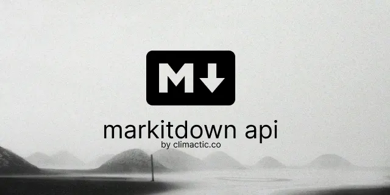

<div align="center">
  
  
  
  <h1>MarkItDown API</h1>
  <p>A REST API for converting files to markdown using AI</p>
</div>

## Features
- Convert files to markdown using Microsoft's markitdown via REST API
- OpenAI integration with customizable host and model
- Authentication with API key

## Setup

### Environment Variables

| Variable                | Description                                   |
|-------------------------|-----------------------------------------------|
| API_KEY                 | Your secret API key for authentication        |
| ALLOWED_ORIGINS         | Comma-separated list of allowed origins       |
| OPENAI_API_BASE         | Base URL for OpenAI API (optional)           |
| OPENAI_API_KEY          | Your OpenAI API key (optional)               |
| OPENAI_MODEL            | The model to use for OpenAI API (optional)   |

Copy .env.example to .env and set your values if you're doing this locally.

### Generate API Key

```bash
python generate_api_key.py
```

### Production

```bash
docker pull ghcr.io/climactic/markitdown-api:latest
docker run -d -p 8000:8000 -e API_KEY=<your_api_key> ghcr.io/climactic/markitdown-api:latest
```

Or use the docker-compose.prod.yml file to start the container.

### Local Development

1. Create a virtual environment:

```bash
python -m venv .venv
source .venv/bin/activate  # On Windows: .venv\Scripts\activate
```

2. Install dependencies:

```bash
pip install -r requirements.txt
```

3. Run the application:

```bash
python run.py
```

The API will be available at `http://localhost:8000`.

### Docker Deployment

1. Build and start the Docker container:

```bash
docker-compose up -d
```

The API will be available at `http://localhost:8000`.

## API Endpoints

### Convert Markdown to Text

```
POST /convert
```

Request:
- Upload a markdown file

Headers:
- X-API-Key: your_api_key (if authentication is enabled)

### Health Check

```
GET /health
```

Response:
```json
{
  "status": "healthy"
}
```

## API Documentation

When the API is running, you can access the interactive API documentation at:

- Swagger UI: `http://localhost:8000/docs`
- ReDoc: `http://localhost:8000/redoc` 

## Sponsors

Sponsors are welcome to support the development of this project.

You can sponsor us on [GitHub Sponsors](https://github.com/sponsors/climactic).

## License

This project is licensed under the MIT License. See the [LICENSE](LICENSE) file for details.